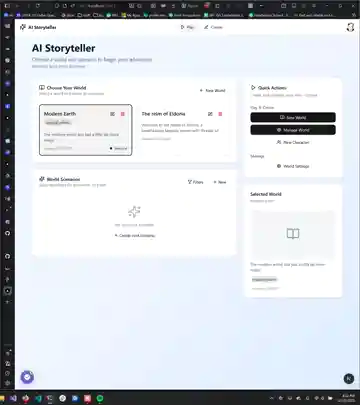

# agnt

**Give your AI coding agent browser superpowers.**

[](https://go.dev/)
[](https://modelcontextprotocol.io)
[](https://www.npmjs.com/package/@standardbeagle/agnt)
[](https://pypi.org/project/agnt/)
[](LICENSE)

## What is agnt?

**agnt** is a new kind of tool designed for the age of AI-assisted development. It acts as a bridge between your AI coding agent and the browser, extending what's possible during vibe coding sessions.

When you're in the flow with Claude Code, Cursor, or other AI coding tools, agnt lets your agent:

- **See what you see** - Screenshots, DOM inspection, and visual debugging
- **Hear from you directly** - Send messages from the browser to your agent
- **Sketch ideas together** - Draw wireframes directly on your UI
- **Debug in real-time** - Capture errors, network traffic, and performance metrics
- **Extend its thinking window** - Use the browser as a persistent scratchpad

## Demo



*Draw wireframes directly on your running app, then send them to your AI agent*

## The Vision: Extending Your Agent's Capabilities

Traditional AI coding assistants are blind to what's happening in the browser. They can write code, but they can't:

- See the visual result of their changes
- Know when JavaScript errors occur
- Understand layout issues you're experiencing
- Receive feedback without you typing it out

**agnt changes this.** It creates a bidirectional channel between your browser and your AI agent:

```
┌─────────────────┐      ┌─────────────────┐      ┌─────────────────┐
│   Your Browser  │ ←──► │      agnt       │ ←──► │   AI Agent      │
│                 │      │                 │      │                 │
│  - See changes  │      │  - Proxy traffic│      │  - Receives     │
│  - Send notes   │      │  - Capture errors│     │    context      │
│  - Draw sketches│      │  - Inject tools │      │  - Acts on      │
│  - Click to log │      │  - Route messages│     │    feedback     │
└─────────────────┘      └─────────────────┘      └─────────────────┘
```

## Quick Start

### Installation

**npm** (recommended):
```bash
npm install -g @standardbeagle/agnt
```

**pip/uv**:
```bash
pip install agnt
# or
uv pip install agnt
```

**From source**:
```bash
git clone https://github.com/standardbeagle/agnt.git
cd agnt
make build && make install-local
```

### As MCP Server (Claude Code, Cursor, etc.)

Add to your MCP configuration:

```json
{
  "mcpServers": {
    "agnt": {
      "command": "agnt",
      "args": ["serve"]
    }
  }
}
```

Or install as a Claude Code plugin:
```bash
/plugin marketplace add standardbeagle/agnt
/plugin install agnt@agnt
```

### As PTY Wrapper (Enhanced Terminal)

Wrap your AI tool for overlay features:

```bash
agnt run claude --dangerously-skip-permissions
agnt run cursor
agnt run aider
```

This adds a terminal overlay menu (Ctrl+P) and enables the browser-to-terminal message bridge.

## Core Features

### 1. Browser Superpowers

Start a proxy and your agent gains eyes into the browser:

```
proxy {action: "start", id: "app", target_url: "http://localhost:3000"}
```

Now your agent can:
```javascript
// Take screenshots
proxy {action: "exec", id: "app", code: "__devtool.screenshot('current-state')"}

// Inspect any element
proxy {action: "exec", id: "app", code: "__devtool.inspect('#submit-button')"}

// Audit accessibility
proxy {action: "exec", id: "app", code: "__devtool.auditAccessibility()"}

// Check what the user clicked
proxy {action: "exec", id: "app", code: "__devtool.interactions.getLastClickContext()"}
```

### 2. The Floating Indicator

Every proxied page gets a small floating bug icon. Click it to:

- **Send messages** directly to your AI agent
- **Take screenshots** of specific areas
- **Select elements** to log their details
- **Open sketch mode** for wireframing

No more alt-tabbing to describe what you see - just click and send.

### 3. Sketch Mode

Press the sketch button and draw directly on your UI:

- Rectangles, circles, arrows, and freehand drawing
- Wireframe elements: buttons, inputs, sticky notes
- Save and send to your agent with one click

Perfect for saying "I want a button here" or "this layout is wrong" without typing a word.

### 4. Real-Time Error Capture

JavaScript errors are automatically captured and available to your agent:

```
proxylog {proxy_id: "app", types: ["error"]}
→ {message: "TypeError: Cannot read property 'map' of undefined",
   stack: "at ProductList (products.js:42)",
   timestamp: "..."}
```

Your agent sees errors as they happen, not when you remember to mention them.

### 5. Extending the Thinking Window

The browser becomes a persistent context window:

- **Panel messages** - Notes that survive conversation resets
- **Sketches** - Visual context your agent can reference
- **Interaction history** - What you clicked, scrolled, typed
- **DOM mutations** - What changed since last check

When context windows fill up, this external state persists.

## MCP Tools

| Tool | Description |
|------|-------------|
| `detect` | Auto-detect project type and available scripts |
| `run` | Execute scripts or commands (background/foreground) |
| `proc` | Manage processes: status, output, stop, list |
| `proxy` | Reverse proxy: start, stop, exec, status |
| `proxylog` | Query logs: http, error, screenshot, sketch, panel_message |
| `currentpage` | View active page sessions with grouped resources |
| `daemon` | Manage background daemon service |

## Browser API (50+ Functions)

The proxy injects `window.__devtool` with powerful diagnostics:

**Element Inspection**
```javascript
__devtool.inspect('#element')     // Full element analysis
__devtool.getPosition('#element') // Bounding box and position
__devtool.isVisible('#element')   // Visibility check
```

**Visual Debugging**
```javascript
__devtool.highlight('.items')           // Highlight elements
__devtool.mutations.highlightRecent()   // Show recent DOM changes
__devtool.screenshot('name')            // Capture screenshot
```

**Accessibility**
```javascript
__devtool.auditAccessibility()    // Full a11y audit with score
__devtool.getContrast('#text')    // Color contrast check
__devtool.getTabOrder()           // Tab navigation order
```

**Interactions**
```javascript
__devtool.interactions.getLastClick()        // Last click details
__devtool.interactions.getLastClickContext() // Full click context
__devtool.selectElement()                    // Interactive picker
```

**Sketch Mode**
```javascript
__devtool.sketch.open()    // Enter sketch mode
__devtool.sketch.save()    // Save and send to agent
__devtool.sketch.toJSON()  // Export sketch data
```

## Configuration

Create `.agnt.kdl` in your project root:

```kdl
scripts {
    dev {
        command "npm"
        args "run" "dev"
        autostart true
    }
}

proxies {
    frontend {
        target "http://localhost:3000"
        autostart true
    }
}
```

## Architecture

agnt uses a daemon architecture for persistent state:

```
┌─────────────────────┐       ┌─────────────────────────────────────┐
│  AI Agent           │       │              agnt                   │
│  (Claude Code, etc.)│◄─────►│                                     │
│                     │ MCP   │  ┌────────────────┐                 │
└─────────────────────┘       │  │  MCP Server    │                 │
                              │  └───────┬────────┘                 │
                              │          │ socket                   │
                              │          ▼                          │
┌─────────────────────┐       │  ┌────────────────────────────────┐ │
│  Browser            │◄──────┼──│        Daemon                  │ │
│                     │ proxy │  │  ProcessManager │ ProxyManager │ │
│  __devtool API      │       │  └────────────────────────────────┘ │
│  Floating Indicator │       └─────────────────────────────────────┘
│  Sketch Mode        │
└─────────────────────┘
```

**Key design decisions:**
- Lock-free concurrency with `sync.Map` and atomics
- Bounded memory with ring buffers
- Processes and proxies survive client disconnections
- Zero-dependency frontend JavaScript

## Documentation

**[Full Documentation →](https://standardbeagle.github.io/agnt/)**

```bash
# Run docs locally
cd docs-site
npm install && npm start
```

## Use Cases

- **Vibe coding** - Stay in flow while your agent sees everything
- **Visual debugging** - Show don't tell - sketch what's wrong
- **Accessibility testing** - Automated a11y audits during development
- **Error tracking** - Catch frontend errors before users do
- **UI reviews** - Annotate designs directly on the live app
- **Remote collaboration** - Share visual context with your agent

## Requirements

- Node.js 18+ or Go 1.24+
- MCP-compatible AI assistant

## Migrating from devtool-mcp

agnt is the new name for devtool-mcp. Existing users:

```bash
# npm
npm uninstall -g @standardbeagle/devtool-mcp
npm install -g @standardbeagle/agnt

# pip
pip uninstall devtool-mcp
pip install agnt
```

Update your MCP config to use `agnt` command with `["serve"]` args.

## License

MIT

## Contributing

Contributions welcome! See the [documentation](https://standardbeagle.github.io/agnt/) for architecture details.
